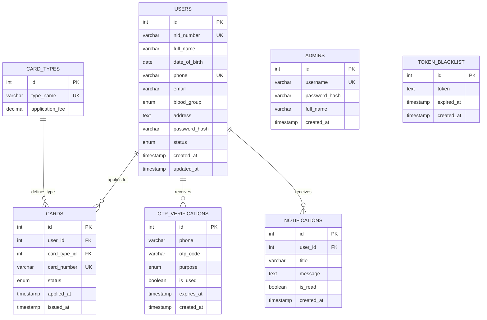

# Entity-Relationship Diagram (ERD)
## Bangladesh Citizen Card System

## Relationships Explained

| Relationship | Type | Description |
|---|---|---|
| USERS → CARDS | One-to-Many | একজন user একাধিক card apply করতে পারে |
| CARD_TYPES → CARDS | One-to-Many | একটি card type এর অনেক card instance থাকতে পারে |
| USERS → OTP_VERIFICATIONS | One-to-Many | একজন user একাধিক OTP receive করতে পারে |
| USERS → NOTIFICATIONS | One-to-Many | একজন user একাধিক notification receive করতে পারে |
| ADMINS | Independent | Admin আলাদাভাবে system manage করে |
| TOKEN_BLACKLIST | Independent | Logout হওয়া JWT tokens store করে |

## Normalization — 3NF Compliance

| Table | 3NF Status | Reason |
|---|---|---|
| USERS | ✅ 3NF | সব column শুধু primary key `id` এর উপর dependent |
| CARD_TYPES | ✅ 3NF | `type_name`, `fee` directly `id` এর উপর dependent |
| CARDS | ✅ 3NF | `card_type` ENUM সরিয়ে `card_type_id` FK দিয়ে normalize করা হয়েছে |
| NOTIFICATIONS | ✅ 3NF | `title`, `message`, `is_read` সবই `id` এর উপর dependent, `user_id` FK |
| OTP_VERIFICATIONS | ✅ 3NF | সব column `id` এর উপর dependent |
| ADMINS | ✅ 3NF | Simple table, কোনো transitive dependency নেই |
| TOKEN_BLACKLIST | ✅ 3NF | Simple table, কোনো transitive dependency নেই |
